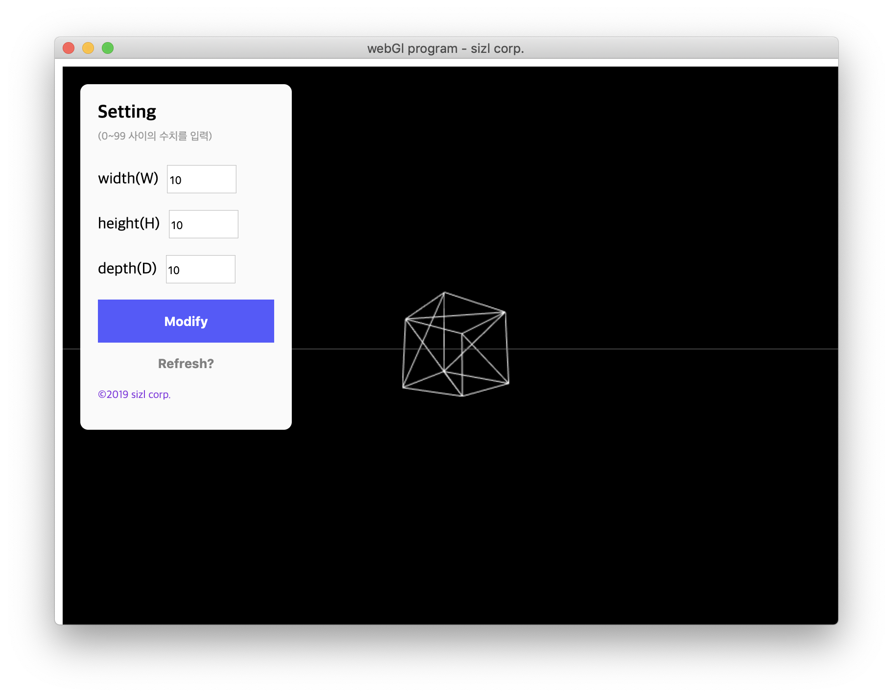

## miniCAD 데스크톱 앱

### electron으로 미니 캐드프로그램 만들기 ###
- electron-quick-start
- webGL
- three js
 

#### 실습 의의 ####

>3d 랜더링 프로그램을 만드는 사내 프로젝트의 일환으로
>electron & webGL 스터디를 진행했습니다.
 
>흥미를 붙이기 위해 랜더링 결과물이 시각적으로 쉽게 연산되는 three js 라이브러리를 함께 사용했습니다.

